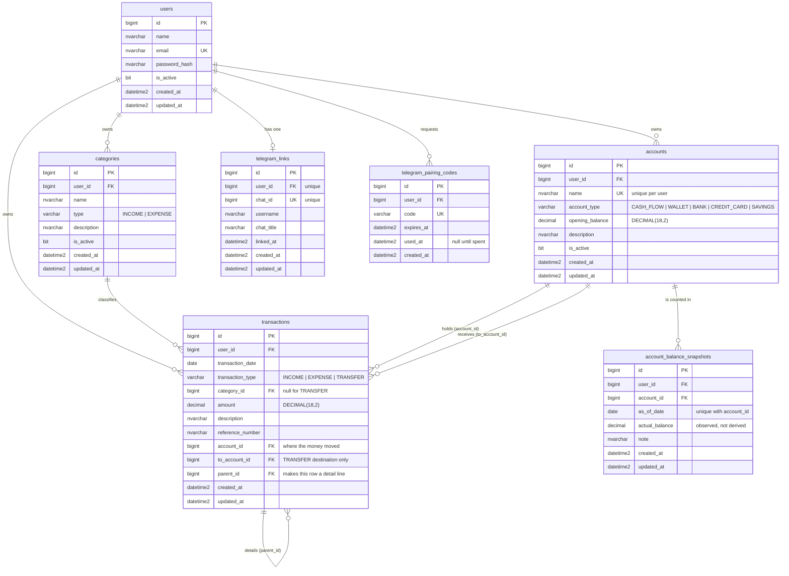

# Tracking Cashflow

Personal finance tracking: transactions, categories, a dashboard and cash flow reports with
Excel and PDF export.

Monorepo with a Go API, a Next.js frontend and SQL Server.

- Backend: Go 1.25, chi, GORM, JWT, bcrypt, golang-migrate, excelize, fpdf, Swagger
- Frontend: Next.js 15 App Router, TypeScript, Tailwind CSS, React Hook Form, Zod, Recharts
- Database: SQL Server 2022, `snake_case`, `DECIMAL(18,2)` for money

## 1. Architecture overview

```
┌──────────────┐        HTTPS/JSON        ┌──────────────┐       TDS       ┌────────────┐
│  Next.js     │ ───────────────────────► │   Go / chi   │ ──────────────► │ SQL Server │
│  App Router  │  Bearer <access_token>   │   REST API   │      GORM       │    2022    │
└──────────────┘                          └──────────────┘                 └────────────┘
```

The browser never reaches the database. Every read and write goes through the API, which is
the only component holding database credentials.

Request flow:

```
Router → Middleware → Handler → Service → Repository → GORM → SQL Server
```

- Handlers parse, validate, delegate and respond. No business logic, no SQL.
- Services own the rules, the money arithmetic and transaction orchestration.
- Repositories own persistence, always scoped by `user_id`.

Money never touches `float64`: `DECIMAL(18,2)` in the database, `shopspring/decimal` in Go,
a decimal string on the wire. `Balance = Total Income − Total Expense`, and a `TRANSFER` is
recorded but excluded from both totals because it only moves funds between accounts.

Ownership comes from the JWT subject, never from the request body or path. Repository methods
take both the id and the owning user id, so a mismatched pair reads as "not found" rather
than exposing another account's row.

More detail: [docs/architecture.md](docs/architecture.md), [docs/database.md](docs/database.md),
[docs/api.md](docs/api.md).

## 2. Folder structure

```
tracking-cashflow/
├── apps/
│   ├── backend/
│   │   ├── cmd/api/            HTTP server
│   │   ├── cmd/migrate/        schema runner, creates the database when missing
│   │   ├── cmd/seed/           development data, refuses to run in production
│   │   ├── internal/
│   │   │   ├── config/         typed .env loader, fails fast
│   │   │   ├── model/          GORM entities
│   │   │   ├── dto/            request and response shapes
│   │   │   ├── validator/      struct validation and field errors
│   │   │   ├── repository/     data access, transaction manager
│   │   │   ├── service/        business logic, daily report, Telegram bot, Excel and PDF
│   │   │   ├── handler/        HTTP adapters
│   │   │   ├── middleware/     auth, logging, secure headers
│   │   │   ├── router/         route table and dependency wiring
│   │   │   └── utils/          envelope, errors, JWT, money, paging, dates
│   │   ├── migrations/         golang-migrate SQL pairs
│   │   ├── docs/               generated OpenAPI spec
│   │   ├── tests/              API integration tests
│   │   └── Dockerfile
│   └── frontend/
│       ├── app/                login, dashboard, transactions, categories, reports, settings
│       ├── components/         ui primitives, layout shell, charts, transaction form
│       ├── hooks/              auth context, async loader
│       ├── lib/                api client, auth storage, formatters
│       ├── schemas/            Zod schemas
│       ├── services/           typed API calls
│       ├── types/              shared types
│       └── Dockerfile
├── database/
│   ├── migrations/             copy of the backend migrations for DBA review
│   ├── seeds/
│   └── scripts/
├── docs/                       architecture, api, database
├── docker-compose.yml
├── .env.example
├── Makefile
└── README.md
```

## 3. Database ERD



Six tables. `accounts` and `account_balance_snapshots` exist for the daily report (§13):
an account is where money sits, and a snapshot is what it *actually* held on a day, which
cannot be derived from the transactions. `transactions.parent_id` breaks one recorded amount
into what it became.

Indexes: `uq_users_email`, `ix_transactions_user_date`, `ix_transactions_user_type_date`,
`ix_transactions_user_category`, `ix_transactions_reference`, `ix_transactions_account`,
`ix_transactions_to_account`, `ix_transactions_parent`, `ix_categories_user_type`,
`uq_accounts_user_name`, `ix_accounts_user_type`,
`uq_account_balance_snapshots_account_date`, `uq_telegram_links_chat`,
`uq_telegram_links_user`, `uq_telegram_pairing_codes_code`. Every one that is queried per user
leads with `user_id`, so ownership-scoped queries seek rather than scan.

## 4. API endpoints

Base URL `/api/v1`. Swagger UI at `/swagger/index.html` — 26 paths, 41 definitions.

| Method | Path | Auth | Purpose |
| --- | --- | --- | --- |
| POST | `/auth/register` | no | create an account |
| POST | `/auth/login` | no | exchange credentials for a token |
| POST | `/auth/logout` | yes | end the client session |
| GET | `/auth/me` | yes | current user |
| GET | `/categories` | yes | list, with `type`, `is_active`, `search`, paging, sorting |
| POST | `/categories` | yes | create |
| GET | `/categories/{id}` | yes | detail |
| PUT | `/categories/{id}` | yes | update |
| PATCH | `/categories/{id}/status` | yes | activate or deactivate |
| DELETE | `/categories/{id}` | yes | delete, 409 when still referenced |
| GET | `/transactions` | yes | list, with search, date range, type, category, paging, sorting |
| POST | `/transactions` | yes | create |
| GET | `/transactions/{id}` | yes | detail |
| PUT | `/transactions/{id}` | yes | update |
| DELETE | `/transactions/{id}` | yes | delete |
| GET | `/dashboard/summary` | yes | totals, charts and recent rows for a range |
| GET | `/reports/summary` | yes | period totals |
| GET | `/reports/cash-flow` | yes | rows with a running balance |
| GET | `/reports/cash-flow/excel` | yes | `.xlsx` download |
| GET | `/reports/cash-flow/pdf` | yes | `.pdf` download |
| GET | `/reports/expense-by-category` | yes | totals grouped by category |
| GET | `/reports/monthly` | yes | one row per month |
| GET | `/reports/daily-cash-flow` | yes | the full daily report as JSON (see §13) |
| GET | `/accounts` | yes | list, with `account_type`, `is_active`, `search`, paging, sorting |
| POST | `/accounts` | yes | create |
| GET | `/accounts/{id}` | yes | detail |
| PUT | `/accounts/{id}` | yes | update |
| PATCH | `/accounts/{id}/status` | yes | activate or deactivate |
| DELETE | `/accounts/{id}` | yes | delete, 409 while still referenced |
| GET | `/accounts/{id}/balances` | yes | observed balance history |
| POST | `/accounts/{id}/balances` | yes | record what the account actually held on a day |
| DELETE | `/accounts/{id}/balances/{balance_id}` | yes | remove one observed balance |
| POST | `/telegram/pairing-code` | yes | single-use code for connecting a chat |
| GET | `/telegram/link` | yes | whether a chat is connected |
| DELETE | `/telegram/link` | yes | disconnect the chat |
| POST | `/telegram/send/daily-report` | yes | push the daily report to the linked chat |
| POST | `/telegram/webhook` | secret | called by Telegram, authenticated by header |
| GET | `/health` | no | liveness probe |

Every JSON response uses one envelope:

```json
{ "success": true, "message": "Data retrieved successfully", "data": {} }
```

```json
{ "success": false, "message": "Validation failed", "errors": { "email": "Email is required" } }
```

## 5. Running the project

### Option A: Docker (everything at once)

```bash
cp .env.example .env
# edit .env: set DB_PASSWORD and JWT_SECRET
docker compose up -d --build
```

Compose starts SQL Server, waits until it answers a query, runs the migrations and the seed
in a one-shot `migrate` service, then starts the API and the frontend.

- Frontend: http://localhost:3000 (`FRONTEND_HOST_PORT`)
- API: http://localhost:8080/api/v1 (`APP_HOST_PORT`)
- Swagger: http://localhost:8080/swagger/index.html

`migrate` runs as a one-shot container before the backend starts, so the first
`docker compose up -d` already comes up against a migrated and seeded database. See
[Ports](#ports) if any of those ports is in use on your machine.

> `make` is not present in a plain Windows shell. Install it (Chocolatey, Scoop or WSL) or
> run the commands the Makefile wraps; every target is a one-liner you can copy.

```bash
make docker-logs   # follow backend and frontend
make docker-down   # stop, keep the database volume
make docker-reset  # stop and delete the database volume
```

### Option B: run on the host

SQL Server still comes from Docker; the apps run locally.

```bash
cp .env.example .env
docker compose up -d sqlserver
make migrate   # creates the database if it does not exist, then applies the schema
make seed      # development user, categories and a month of transactions
make run       # API on APP_PORT
make run-frontend   # Next.js dev server on 3000
```

### Ports

Every published port is an environment variable, because the defaults collide with things
that are commonly already running (a local SQL Server on 1433, Jenkins on 8080, Grafana on
3000). Inside the compose network the ports are fixed — SQL Server is always 1433 and the
API always 8080 — so only the host side changes.

| Variable | Default | What it publishes |
| --- | --- | --- |
| `SQLSERVER_HOST_PORT` | 1433 | SQL Server |
| `APP_HOST_PORT` | 8080 | the API |
| `FRONTEND_HOST_PORT` | 3000 | the web app |

Two variables have to be kept in step with whatever you pick, because they describe the
stack as seen from the browser rather than from inside the network:

- `NEXT_PUBLIC_API_URL` must point at `http://localhost:<APP_HOST_PORT>/api/v1`. Next.js
  inlines it at build time, so changing it needs `docker compose build frontend`, not just
  a restart.
- `CORS_ALLOWED_ORIGINS` must contain `http://localhost:<FRONTEND_HOST_PORT>`.

`DB_PORT` is only read when the backend runs on the host (Option B); in compose it is
always 1433. The set this project was verified with, on a machine where 1433, 8080 and
3000 were all taken:

```dotenv
SQLSERVER_HOST_PORT=14330
DB_PORT=14330
APP_HOST_PORT=8090
FRONTEND_HOST_PORT=3100
NEXT_PUBLIC_API_URL=http://localhost:8090/api/v1
CORS_ALLOWED_ORIGINS=http://localhost:3000,http://localhost:3100
```

## 6. Migrations

```bash
make migrate           # apply everything that is pending
make migrate-down      # roll back one step
make migrate-version   # print the current version and whether it is dirty
```

The runner is a Go binary, so no extra CLI is needed. It creates the application database
when it is missing, which golang-migrate cannot do on its own. `drop` is refused when
`APP_ENV=production`.

Migrations live in `apps/backend/migrations` as plain SQL pairs:

```
000001_create_users.up.sql               / .down.sql
000002_create_categories.up.sql          / .down.sql
000003_create_transactions.up.sql        / .down.sql
000004_create_accounts.up.sql            / .down.sql
000005_add_transaction_accounts.up.sql   / .down.sql
000006_create_telegram_links.up.sql      / .down.sql
```

`000005` adds columns and then constrains them, which SQL Server cannot do in one batch
because it compiles the batch as a whole. The statements after the `ALTER TABLE ADD` are
wrapped in `EXEC(N'...')` to force a fresh compilation scope. Every `down` is reversible and
the 4-to-6 round trip is exercised, not assumed.

`make sync-db-docs` copies them into `database/migrations` for DBA review.

## 7. Tests

```bash
make test         # unit tests, and integration tests when a database is reachable
make test-cover   # same, with a total coverage figure
```

93 test functions in all.

Unit tests cover the money arithmetic, paging, the sort allow list, JWT handling, and the
auth, category, transaction, report and daily-report services against in-memory fakes. The
daily report's worked example is asserted figure by figure, and one test walks the rendered
Telegram message asserting no MarkdownV2 special character is left unescaped — Telegram
rejects the whole message otherwise, so this is the check that keeps the bot working.

Integration tests in `apps/backend/tests` drive the real router against SQL Server:
register, login, token rejection, transaction CRUD, ownership, filtering, paging, category
lifecycle, every report, both exports, account lifecycle and ownership, observed balances,
transfer validation, the Telegram pairing endpoints, and the full daily report end to end. They **skip** themselves when no database is
reachable so the suite stays green on a machine without the stack:

```bash
cd apps/backend && INTEGRATION=1 go test ./tests/ -v   # turn a skip into a failure
```

Each run creates its own throwaway account and deletes only its own rows afterwards.

```bash
make lint   # gofmt check, go vet, ESLint
```

## 8. Example login

The seed creates a development account:

```
email:    admin@example.com
password: Admin123!
```

Do not use these credentials outside development. `make seed` refuses to run when
`APP_ENV=production`.

## 9. Example API requests

```bash
API=http://localhost:8080/api/v1

# login
TOKEN=$(curl -s -X POST "$API/auth/login" \
  -H 'Content-Type: application/json' \
  -d '{"email":"admin@example.com","password":"Admin123!"}' \
  | sed -n 's/.*"access_token":"\([^"]*\)".*/\1/p')

# current user
curl -s "$API/auth/me" -H "Authorization: Bearer $TOKEN"

# create an expense
curl -s -X POST "$API/transactions" \
  -H "Authorization: Bearer $TOKEN" -H 'Content-Type: application/json' \
  -d '{
        "transaction_date": "2026-09-25",
        "transaction_type": "EXPENSE",
        "category_id": 6,
        "amount": "1150000.00",
        "description": "Cicilan Rumah September",
        "reference_number": "INV-0001"
      }'

# list with filters
curl -s "$API/transactions?date_from=2026-09-01&date_to=2026-09-30&transaction_type=EXPENSE&page=1&page_size=10" \
  -H "Authorization: Bearer $TOKEN"

# dashboard
curl -s "$API/dashboard/summary?range=month" -H "Authorization: Bearer $TOKEN"

# cash flow report
curl -s "$API/reports/cash-flow?date_from=2026-09-01&date_to=2026-09-30" \
  -H "Authorization: Bearer $TOKEN"
```

A transfer carries no category:

```bash
curl -s -X POST "$API/transactions" \
  -H "Authorization: Bearer $TOKEN" -H 'Content-Type: application/json' \
  -d '{"transaction_date":"2026-09-25","transaction_type":"TRANSFER","amount":"2000000","description":"Move to savings"}'
```

## 10. Generating Excel and PDF

From the UI: open **Laporan**, pick the date range and filters, press **Tampilkan Laporan**,
then **Ekspor Excel** or **Ekspor PDF**. The export always matches the preview on screen,
because both use the filters that produced it.

From the API:

```bash
curl -s -o cash-flow.xlsx \
  "$API/reports/cash-flow/excel?date_from=2026-09-01&date_to=2026-09-30" \
  -H "Authorization: Bearer $TOKEN"

curl -s -o cash-flow.pdf \
  "$API/reports/cash-flow/pdf?date_from=2026-09-01&date_to=2026-09-30" \
  -H "Authorization: Bearer $TOKEN"
```

The workbook has two sheets: **Summary** (period and totals) and **Transactions** (date,
type, category, description, reference, income, expense, running balance) with a frozen
header, currency and date formats, column widths and a total row. The PDF is landscape with
the same table, repeating the header on every page.

## 11. Known limitations

- **Logout does not revoke the token.** It is stateless: the client drops it and the API
  stops trusting it at expiry. A stolen token stays valid until `JWT_EXPIRATION` passes.
  A deny list or short-lived tokens with refresh would fix this and both need storage.
- **No refresh token.** When the token expires the user logs in again.
- **A transfer without accounts is still just a tag.** `TRANSFER` now carries `account_id` and
  `to_account_id`, so it can be reconciled between two accounts — but both stay optional, and a
  transfer recorded without them is excluded from the totals and appears in no account section.
- **Reports load the whole period into memory.** A cash flow report over several years of
  dense data will be large; the endpoint has no paging.
- **The frontend keeps the token in `localStorage`**, which is readable by any script running
  on the page. An httpOnly cookie plus CSRF protection is stronger and needs a backend change.
- **Dashboard "income vs expense" shows one bar per month in the range.** Picking "today"
  yields a single bar, which is correct but not very informative.
- **Rate limiting is per instance and in memory.** Behind several replicas each one counts
  separately; a shared store would be needed.
- **`docker compose` seeds on every start** in non-production. The seed is idempotent, so it
  adds nothing on a second run, but it does connect and check.
- **A newly registered user has no categories.** Only the seeded development account gets
  them; everyone else creates their own before recording an income or expense. Seeding a
  starter set on registration would be a small service change.
- **Registration does not log the user in.** `POST /auth/register` returns the created user,
  not a token, so the client calls `POST /auth/login` afterwards. The web app does this for
  you; a direct API consumer has to make both calls.
- **One bot token cannot be shared.** Two processes polling the same token terminate each
  other's long poll and Telegram answers `409 Conflict`. If another service already uses the
  bot, create a second one in @BotFather for this app.
- **Nothing sends the report on a schedule.** Delivery is pulled (`/report` in the chat) or
  pushed on request (`POST /telegram/send/daily-report`). A nightly send needs a scheduler,
  which is a cron entry or a job runner, not a code change.
- **A chat-recorded expense always lands in one category** (`Kebutuhan Harian`) and on today's
  date. Choosing a category or a past date from the chat is not supported; edit the row in the
  web app instead.
- **`/topup` guesses the source only when there is exactly one bank account.** With several it
  asks rather than picking, so the money cannot land in the wrong place silently.
- **Amounts from the chat are whole rupiah.** Decimals are refused, because `1.5` and `1.500`
  cannot both be honoured without risking a tenfold error.
- **The daily report covers one day.** There is no weekly or monthly variant of it, and no
  Excel or PDF export of it — the existing exports cover the cash-flow report instead.
- **The opening balance is derived, not stored.** It is the cash flow accounts' opening
  balances plus every cash flow movement before the date, so correcting old history moves it.
  A stored month-opening figure would be steadier but has to be maintained.
- **The bot speaks Indonesian only**, and the report's labels are fixed in the renderer rather
  than being configurable per user.

## 12. Recommended next steps

1. **Refresh tokens and a revocation list**, so logout and a stolen token both have teeth.
2. **Require accounts on a transfer** once existing rows are backfilled, so the database
   enforces what the report already assumes.
3. **Budgets per category per month**, with the dashboard showing spend against budget.
4. **Server-side paging for reports**, plus a streaming export so a multi-year Excel file
   does not have to fit in memory.
5. **Recurring transactions**, since a mortgage or a salary is the same row every month.
6. **Multi-currency**, which needs a rate table and a decision about which currency the
   totals report in.
7. **CI**: run `make lint` and `make test` on every push, with SQL Server as a service
   container so the integration tests run there too.
8. **Attachment upload** for receipts, kept out of the database itself.
9. **Scheduled delivery** of the daily report, with the send time set per user.
10. **Category and date on a chat-recorded expense**, so `/catat` does not always file under
    one category on today's date.

## 13. Daily cash flow report and Telegram

A second reporting path, built for reading on a phone rather than in a spreadsheet. The same
report serves `GET /reports/daily-cash-flow` as JSON and the Telegram bot as a message.

### Accounts are what make it possible

The generic report groups by category. This one groups by **account**, and `account_type` is a
reporting role rather than a label for the instrument:

| Type | Section it drives |
| --- | --- |
| `CASH_FLOW` | opening balance and the household expense lines |
| `CREDIT_CARD` | the bill paid, netted against money taken back off the card |
| `BANK` | money in, fees, money out, and what was already sitting there |
| `WALLET` | an allowance: handed over, recorded, and what is actually left |
| `SAVINGS` | a top-up destination that is set aside rather than spent |

Two more pieces carry the rest:

- **`account_balance_snapshots`** stores what an account *actually* held on a day, counted by
  hand or read off a banking app. It cannot be derived from the transactions, and the gap
  between the two is the report's most useful number: spending that was never written down.
- **`transactions.parent_id`** breaks one recorded amount into what it became. A 100.000 cash
  withdrawal is listed once, with the ice cream and the fuel underneath. Only parents count
  towards a total.

`TRANSFER` now carries `account_id` and `to_account_id`, so a transfer is a real movement
between two accounts. That also closes the "transfer has no counter-account" limitation this
README used to list.

### Setting up the bot

Use a bot that nothing else polls — see the note on sharing a token below.

```bash
# 1. Create a bot with @BotFather (/newbot) and copy its token into .env.
#    Both .env and apps/backend/.env are read: the compose stack uses the first,
#    a host-run backend (Option B) uses the second.
TELEGRAM_MODE=polling
TELEGRAM_BOT_TOKEN=<token from BotFather>

# 2. Restart the API. It verifies the token and starts listening:
#    INFO telegram bot ready username=... webhook=false
#    INFO telegram poller started
```

Then connect a chat. Open **Pengaturan** in the web app, press **Buat Kode Pairing**, and send
`/start <code>` to the bot — or do the same over the API:

```bash
curl -s -X POST "$API/telegram/pairing-code" -H "Authorization: Bearer $TOKEN"
# {"data":{"code":"YNR4JBLH","instruction":"Kirim pesan \"/start YNR4JBLH\" ke bot Telegram"}}
```

A chat id proves nothing — anyone can find a bot and message it — so the bot answers an
unlinked chat with nothing but "not linked". The code is single-use, short-lived, and comes
from `crypto/rand`.

### Commands

Reading:

| Command | Does |
| --- | --- |
| `/report` | today's report |
| `/report 2026-09-25` | a given day |
| `/saldo` | recorded balance per account |
| `/status` | connection status |

Writing — these change the database, and the bot replies with what was stored plus the
variance it produces, so a typo is visible immediately:

| Command | Does |
| --- | --- |
| `/saldo Dompet Harian 72500` | records the balance the account actually holds today |
| `/saldo Bank Utama 20000 2026-09-25` | same, for an earlier day |
| `/catat Dompet Harian 25000 kopi` | records an expense |
| `/topup Dompet Harian 600000` | transfers into the account from the bank |
| `/topup Dompet Harian 600000 dari BCA` | names the source explicitly |
| `/hapus 42` | deletes a transaction recorded by mistake |

Account names may contain spaces and need no quoting: the longest matching name wins, so
`Dana Cadangan` is never mistaken for `Dana`. Amounts accept `25000`, `25.000`, `25rb`, `1jt`.
**Separators are validated as thousand groups, not stripped** — `1.5jt` is refused rather than
silently read as 15.000.000.

Recording a balance twice for the same day overwrites it, so correcting a typo is just sending
the command again. `/catat` files the expense under `Kebutuhan Harian`, created on demand, and
it can be recategorised later in the web app. `/catat` prints the row's id, which is what
`/hapus` takes.

Every write goes through the same services the HTTP handlers use, so the ownership checks and
validation cannot be bypassed by talking to the bot: an account or transaction id belonging to
somebody else reads as missing. A chat that is not paired is refused every command.

### Polling or webhook

| | Needs a public URL | Use when |
| --- | --- | --- |
| `TELEGRAM_MODE=polling` | no | local development, or a server behind NAT |
| `TELEGRAM_MODE=webhook` | yes, HTTPS | production, where Telegram can reach you |

Webhook mode also needs `TELEGRAM_WEBHOOK_URL` and `TELEGRAM_WEBHOOK_SECRET`. The secret is
echoed back by Telegram in `X-Telegram-Bot-Api-Secret-Token` and compared in constant time, so
knowing the URL is not enough to post forged updates; with no secret set the endpoint returns
404 rather than accepting anything. Startup reconciles the two modes, because Telegram refuses
`getUpdates` while a webhook is registered.

**One bot token, one consumer.** Two polling processes on the same token terminate each
other's long poll and Telegram answers `409 Conflict: terminated by other getUpdates request`.
Registering a webhook does not avoid it either: that makes the other process's `getUpdates`
fail outright. If another service already uses a bot, create a second one for this app.

`TELEGRAM_MODE=off` (the default) disables the integration entirely, and the webhook endpoint
then answers 404 rather than sitting open on a stale secret.

### What the report looks like

```
📊 CASH FLOW SEPTEMBER 2026
📅 25/09
━━━━━━━━━━━━━━
💰 SALDO AWAL
Saldo Awal Cash Flow
Rp8.500.000
━━━━━━━━━━━━━━
💸 PENGELUARAN CASH FLOW
• Cicilan Rumah : Rp1.150.000
• Belanja Bulanan : Rp3.000.000
➡️ Total Pengeluaran : Rp5.000.000
━━━━━━━━━━━━━━
💳 PAYMENT CC
• Bayar tagihan : Rp1.750.000
• Ambil kembali / Top-up : Rp900.000
➡️ Net Payment CC
Rp1.750.000 − Rp900.000
= Rp850.000
━━━━━━━━━━━━━━
🏦 DOMPET HARIAN
Jatah Dompet Harian : Rp600.000
• Tarik Tunai : Rp100.000
  ◦ Makan siang : Rp25.000
  ◦ Bensin : Rp30.000
➡️ Total transaksi tercatat
Rp500.000
━━━━━━━━━━━━━━
💰 SISA DOMPET HARIAN
➡️ Sisa menurut catatan  Rp100.000
Namun saldo aktual yang ada: Rp72.500
➡️ Rp27.500 = transaksi yang belum tercatat
━━━━━━━━━━━━━━
📊 REKONSILIASI TOP-UP
= Rp900.000 ✅
➡️ Selisih Top-up : Rp0
```

The bot receives this as MarkdownV2, where an unescaped `.` or `-` in an amount makes Telegram
reject the whole message. Every value is escaped before the bold markers are added, and a test
walks the rendered output asserting nothing is left bare. Long reports are split on section
boundaries to stay under the 4096-character limit.

Sections with nothing to say are omitted, so a quiet day is a short message. A wallet or bank
reports a variance only once a balance has been recorded for it — without one it stops at the
expected figure instead of inventing a difference.

### Trying it with the seeded data

`make seed` loads the worked example above on today's date, so `/report` with no argument
returns the full report. Every figure in it — `850.000`, `500.000`, `100.000`, `27.500`,
`12.500`, `7.500`, and a reconciliation difference of `0` — is computed, not stored. Only the
opening balance differs from the sample above, because it is derived from whatever history the
seed left behind.
