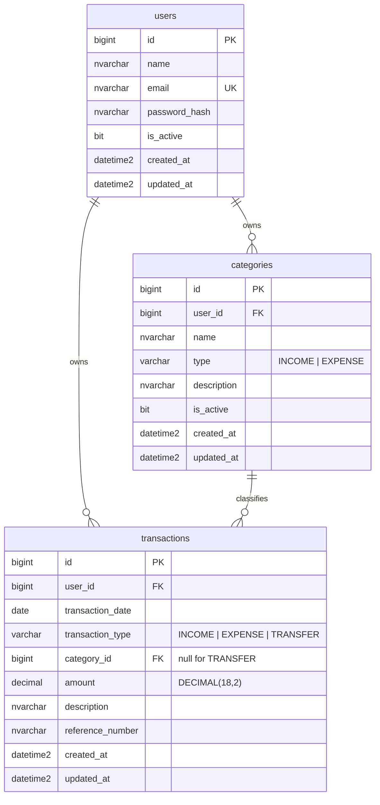

# Tracking Cashflow

Personal finance tracking: transactions, categories, a dashboard and cash flow reports with
Excel and PDF export.

Monorepo with a Go API, a Next.js frontend and SQL Server.

- Backend: Go 1.25, chi, GORM, JWT, bcrypt, golang-migrate, excelize, fpdf, Swagger
- Frontend: Next.js 15 App Router, TypeScript, Tailwind CSS, React Hook Form, Zod, Recharts
- Database: SQL Server 2022, `snake_case`, `DECIMAL(18,2)` for money

## 1. Architecture overview

```
┌──────────────┐        HTTPS/JSON        ┌──────────────┐       TDS       ┌────────────┐
│  Next.js     │ ───────────────────────► │   Go / chi   │ ──────────────► │ SQL Server │
│  App Router  │  Bearer <access_token>   │   REST API   │      GORM       │    2022    │
└──────────────┘                          └──────────────┘                 └────────────┘
```

The browser never reaches the database. Every read and write goes through the API, which is
the only component holding database credentials.

Request flow:

```
Router → Middleware → Handler → Service → Repository → GORM → SQL Server
```

- Handlers parse, validate, delegate and respond. No business logic, no SQL.
- Services own the rules, the money arithmetic and transaction orchestration.
- Repositories own persistence, always scoped by `user_id`.

Money never touches `float64`: `DECIMAL(18,2)` in the database, `shopspring/decimal` in Go,
a decimal string on the wire. `Balance = Total Income − Total Expense`, and a `TRANSFER` is
recorded but excluded from both totals because it only moves funds between accounts.

Ownership comes from the JWT subject, never from the request body or path. Repository methods
take both the id and the owning user id, so a mismatched pair reads as "not found" rather
than exposing another account's row.

More detail: [docs/architecture.md](docs/architecture.md), [docs/database.md](docs/database.md),
[docs/api.md](docs/api.md).

## 2. Folder structure

```
tracking-cashflow/
├── apps/
│   ├── backend/
│   │   ├── cmd/api/            HTTP server
│   │   ├── cmd/migrate/        schema runner, creates the database when missing
│   │   ├── cmd/seed/           development data, refuses to run in production
│   │   ├── internal/
│   │   │   ├── config/         typed .env loader, fails fast
│   │   │   ├── model/          GORM entities
│   │   │   ├── dto/            request and response shapes
│   │   │   ├── validator/      struct validation and field errors
│   │   │   ├── repository/     data access, transaction manager
│   │   │   ├── service/        business logic, Excel and PDF builders
│   │   │   ├── handler/        HTTP adapters
│   │   │   ├── middleware/     auth, logging, secure headers
│   │   │   ├── router/         route table and dependency wiring
│   │   │   └── utils/          envelope, errors, JWT, money, paging, dates
│   │   ├── migrations/         golang-migrate SQL pairs
│   │   ├── docs/               generated OpenAPI spec
│   │   ├── tests/              API integration tests
│   │   └── Dockerfile
│   └── frontend/
│       ├── app/                login, dashboard, transactions, categories, reports
│       ├── components/         ui primitives, layout shell, charts, transaction form
│       ├── hooks/              auth context, async loader
│       ├── lib/                api client, auth storage, formatters
│       ├── schemas/            Zod schemas
│       ├── services/           typed API calls
│       ├── types/              shared types
│       └── Dockerfile
├── database/
│   ├── migrations/             copy of the backend migrations for DBA review
│   ├── seeds/
│   └── scripts/
├── docs/                       architecture, api, database
├── docker-compose.yml
├── .env.example
├── Makefile
└── README.md
```

## 3. Database ERD



Indexes: `uq_users_email`, `ix_transactions_user_date`, `ix_transactions_user_type_date`,
`ix_transactions_user_category`, `ix_transactions_reference`, `ix_categories_user_type`.
Every one leads with `user_id`, so ownership-scoped queries seek rather than scan.

## 4. API endpoints

Base URL `\/api\/v1`. Swagger UI at `\/swagger\/index.html`.

| Method | Path | Auth | Purpose |
| --- | --- | --- | --- |
| POST | `/auth/register` | no | create an account |
| POST | `/auth/login` | no | exchange credentials for a token |
| POST | `/auth/logout` | yes | end the client session |
| GET | `/auth/me` | yes | current user |
| GET | `/categories` | yes | list, with `type`, `is_active`, `search`, paging, sorting |
| POST | `/categories` | yes | create |
| GET | `/categories/{id}` | yes | detail |
| PUT | `/categories/{id}` | yes | update |
| PATCH | `/categories/{id}/status` | yes | activate or deactivate |
| DELETE | `/categories/{id}` | yes | delete, 409 when still referenced |
| GET | `/transactions` | yes | list, with search, date range, type, category, paging, sorting |
| POST | `/transactions` | yes | create |
| GET | `/transactions/{id}` | yes | detail |
| PUT | `/transactions/{id}` | yes | update |
| DELETE | `/transactions/{id}` | yes | delete |
| GET | `/dashboard/summary` | yes | totals, charts and recent rows for a range |
| GET | `/reports/summary` | yes | period totals |
| GET | `/reports/cash-flow` | yes | rows with a running balance |
| GET | `/reports/cash-flow/excel` | yes | `.xlsx` download |
| GET | `/reports/cash-flow/pdf` | yes | `.pdf` download |
| GET | `/reports/expense-by-category` | yes | totals grouped by category |
| GET | `/reports/monthly` | yes | one row per month |
| GET | `/health` | no | liveness probe |

Every JSON response uses one envelope:

```json
{ "success": true, "message": "Data retrieved successfully", "data": {} }
```

```json
{ "success": false, "message": "Validation failed", "errors": { "email": "Email is required" } }
```

## 5. Running the project

### Option A: Docker (everything at once)

```bash
cp .env.example .env
# edit .env: set DB_PASSWORD and JWT_SECRET
docker compose up -d --build
```

Compose starts SQL Server, waits until it answers a query, runs the migrations and the seed
in a one-shot `migrate` service, then starts the API and the frontend.

- Frontend: http://localhost:3000 (`FRONTEND_HOST_PORT`)
- API: http://localhost:8080/api/v1 (`APP_HOST_PORT`)
- Swagger: http://localhost:8080/swagger/index.html

`migrate` runs as a one-shot container before the backend starts, so the first
`docker compose up -d` already comes up against a migrated and seeded database. See
[Ports](#ports) if any of those ports is in use on your machine.

> `make` is not present in a plain Windows shell. Install it (Chocolatey, Scoop or WSL) or
> run the commands the Makefile wraps; every target is a one-liner you can copy.

```bash
make docker-logs   # follow backend and frontend
make docker-down   # stop, keep the database volume
make docker-reset  # stop and delete the database volume
```

### Option B: run on the host

SQL Server still comes from Docker; the apps run locally.

```bash
cp .env.example .env
docker compose up -d sqlserver
make migrate   # creates the database if it does not exist, then applies the schema
make seed      # development user, categories and a month of transactions
make run       # API on APP_PORT
make run-frontend   # Next.js dev server on 3000
```

### Ports

Every published port is an environment variable, because the defaults collide with things
that are commonly already running (a local SQL Server on 1433, Jenkins on 8080, Grafana on
3000). Inside the compose network the ports are fixed — SQL Server is always 1433 and the
API always 8080 — so only the host side changes.

| Variable | Default | What it publishes |
| --- | --- | --- |
| `SQLSERVER_HOST_PORT` | 1433 | SQL Server |
| `APP_HOST_PORT` | 8080 | the API |
| `FRONTEND_HOST_PORT` | 3000 | the web app |

Two variables have to be kept in step with whatever you pick, because they describe the
stack as seen from the browser rather than from inside the network:

- `NEXT_PUBLIC_API_URL` must point at `http://localhost:<APP_HOST_PORT>/api/v1`. Next.js
  inlines it at build time, so changing it needs `docker compose build frontend`, not just
  a restart.
- `CORS_ALLOWED_ORIGINS` must contain `http://localhost:<FRONTEND_HOST_PORT>`.

`DB_PORT` is only read when the backend runs on the host (Option B); in compose it is
always 1433. The set this project was verified with, on a machine where 1433, 8080 and
3000 were all taken:

```dotenv
SQLSERVER_HOST_PORT=14330
DB_PORT=14330
APP_HOST_PORT=8090
FRONTEND_HOST_PORT=3100
NEXT_PUBLIC_API_URL=http://localhost:8090/api/v1
CORS_ALLOWED_ORIGINS=http://localhost:3000,http://localhost:3100
```

## 6. Migrations

```bash
make migrate           # apply everything that is pending
make migrate-down      # roll back one step
make migrate-version   # print the current version and whether it is dirty
```

The runner is a Go binary, so no extra CLI is needed. It creates the application database
when it is missing, which golang-migrate cannot do on its own. `drop` is refused when
`APP_ENV=production`.

Migrations live in `apps/backend/migrations` as plain SQL pairs:

```
000001_create_users.up.sql      / .down.sql
000002_create_categories.up.sql / .down.sql
000003_create_transactions.up.sql / .down.sql
```

`make sync-db-docs` copies them into `database/migrations` for DBA review.

## 7. Tests

```bash
make test         # unit tests, and integration tests when a database is reachable
make test-cover   # same, with a total coverage figure
```

Unit tests cover the money arithmetic, paging, the sort allow list, JWT handling, and the
auth, category, transaction and report services against in-memory fakes.

Integration tests in `apps/backend/tests` drive the real router against SQL Server:
register, login, token rejection, transaction CRUD, ownership, filtering, paging, category
lifecycle, every report, and both exports. They **skip** themselves when no database is
reachable so the suite stays green on a machine without the stack:

```bash
cd apps/backend && INTEGRATION=1 go test ./tests/ -v   # turn a skip into a failure
```

Each run creates its own throwaway account and deletes only its own rows afterwards.

```bash
make lint   # gofmt check, go vet, ESLint
```

## 8. Example login

The seed creates a development account:

```
email:    admin@example.com
password: Admin123!
```

Do not use these credentials outside development. `make seed` refuses to run when
`APP_ENV=production`.

## 9. Example API requests

```bash
API=http://localhost:8080/api/v1

# login
TOKEN=$(curl -s -X POST "$API/auth/login" \
  -H 'Content-Type: application/json' \
  -d '{"email":"admin@example.com","password":"Admin123!"}' \
  | sed -n 's/.*"access_token":"\([^"]*\)".*/\1/p')

# current user
curl -s "$API/auth/me" -H "Authorization: Bearer $TOKEN"

# create an expense
curl -s -X POST "$API/transactions" \
  -H "Authorization: Bearer $TOKEN" -H 'Content-Type: application/json' \
  -d '{
        "transaction_date": "2026-09-25",
        "transaction_type": "EXPENSE",
        "category_id": 6,
        "amount": "1150000.00",
        "description": "Cicilan Rumah September",
        "reference_number": "INV-0001"
      }'

# list with filters
curl -s "$API/transactions?date_from=2026-09-01&date_to=2026-09-30&transaction_type=EXPENSE&page=1&page_size=10" \
  -H "Authorization: Bearer $TOKEN"

# dashboard
curl -s "$API/dashboard/summary?range=month" -H "Authorization: Bearer $TOKEN"

# cash flow report
curl -s "$API/reports/cash-flow?date_from=2026-09-01&date_to=2026-09-30" \
  -H "Authorization: Bearer $TOKEN"
```

A transfer carries no category:

```bash
curl -s -X POST "$API/transactions" \
  -H "Authorization: Bearer $TOKEN" -H 'Content-Type: application/json' \
  -d '{"transaction_date":"2026-09-25","transaction_type":"TRANSFER","amount":"2000000","description":"Move to savings"}'
```

## 10. Generating Excel and PDF

From the UI: open **Laporan**, pick the date range and filters, press **Tampilkan Laporan**,
then **Ekspor Excel** or **Ekspor PDF**. The export always matches the preview on screen,
because both use the filters that produced it.

From the API:

```bash
curl -s -o cash-flow.xlsx \
  "$API/reports/cash-flow/excel?date_from=2026-09-01&date_to=2026-09-30" \
  -H "Authorization: Bearer $TOKEN"

curl -s -o cash-flow.pdf \
  "$API/reports/cash-flow/pdf?date_from=2026-09-01&date_to=2026-09-30" \
  -H "Authorization: Bearer $TOKEN"
```

The workbook has two sheets: **Summary** (period and totals) and **Transactions** (date,
type, category, description, reference, income, expense, running balance) with a frozen
header, currency and date formats, column widths and a total row. The PDF is landscape with
the same table, repeating the header on every page.

## 11. Known limitations

- **Logout does not revoke the token.** It is stateless: the client drops it and the API
  stops trusting it at expiry. A stolen token stays valid until `JWT_EXPIRATION` passes.
  A deny list or short-lived tokens with refresh would fix this and both need storage.
- **No refresh token.** When the token expires the user logs in again.
- **`transfer` has no counter-account.** The type is recorded and excluded from the totals,
  but the pair of accounts is not modelled, so a transfer cannot be reconciled between them.
- **Reports load the whole period into memory.** A cash flow report over several years of
  dense data will be large; the endpoint has no paging.
- **The frontend keeps the token in `localStorage`**, which is readable by any script running
  on the page. An httpOnly cookie plus CSRF protection is stronger and needs a backend change.
- **Dashboard "income vs expense" shows one bar per month in the range.** Picking "today"
  yields a single bar, which is correct but not very informative.
- **Rate limiting is per instance and in memory.** Behind several replicas each one counts
  separately; a shared store would be needed.
- **`docker compose` seeds on every start** in non-production. The seed is idempotent, so it
  adds nothing on a second run, but it does connect and check.
- **A newly registered user has no categories.** Only the seeded development account gets
  them; everyone else creates their own before recording an income or expense. Seeding a
  starter set on registration would be a small service change.
- **Registration does not log the user in.** `POST /auth/register` returns the created user,
  not a token, so the client calls `POST /auth/login` afterwards. The web app does this for
  you; a direct API consumer has to make both calls.

## 12. Recommended next steps

1. **Refresh tokens and a revocation list**, so logout and a stolen token both have teeth.
2. **Account modelling for transfers**: a from and a to account turns the type into a real
   double entry and makes reconciliation possible.
3. **Budgets per category per month**, with the dashboard showing spend against budget.
4. **Server-side paging for reports**, plus a streaming export so a multi-year Excel file
   does not have to fit in memory.
5. **Recurring transactions**, since a mortgage or a salary is the same row every month.
6. **Multi-currency**, which needs a rate table and a decision about which currency the
   totals report in.
7. **CI**: run `make lint` and `make test` on every push, with SQL Server as a service
   container so the integration tests run there too.
8. **Attachment upload** for receipts, kept out of the database itself.
