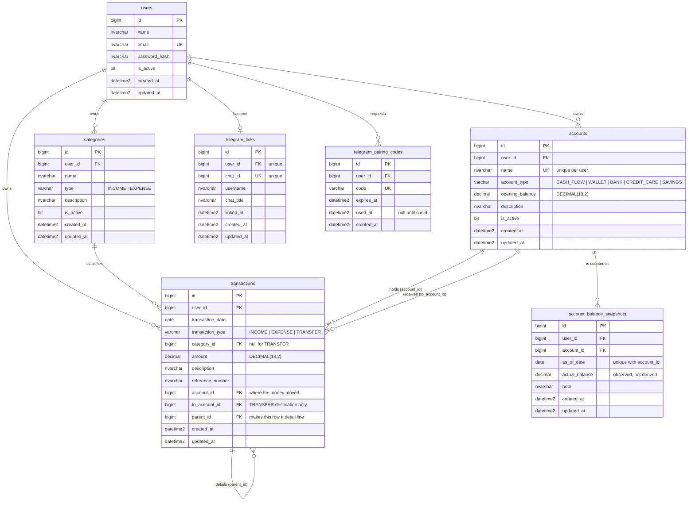

# Database

SQL Server 2022. All identifiers are `snake_case`.

## ERD



## Account types

`account_type` is a reporting role, not a label for the instrument: it decides which section
of the daily report an account appears in.

| Type | Section it drives |
| --- | --- |
| `CASH_FLOW` | the opening balance and the "pengeluaran cash flow" lines |
| `CREDIT_CARD` | payment section: the bill paid, netted against money taken back off the card |
| `BANK` | mutation section: money in, fees, money out, and what was already there |
| `WALLET` | an allowance: what was handed over, what was recorded, what is actually left |
| `SAVINGS` | a top-up destination that is set aside rather than spent |

A transaction with no `account_id` is treated as cash flow, so rows recorded before accounts
existed keep counting.

## Why observed balances are stored

`account_balance_snapshots` holds a balance read off a banking app or counted by hand. It
cannot be derived from the transactions, and the difference between the two is the point:
what the records say should be left, minus what is actually there, is spending that was never
written down. Without this table the report can show an expected remainder but never a
variance.

One row per account per day. Re-counting the same day corrects the figure rather than adding
a second, contradictory row. GORM's `clause.OnConflict` is ignored by the SQL Server driver,
so the repository does an explicit update-then-insert instead.

## Detail lines

`transactions.parent_id` lets one recorded amount be broken into what it was actually spent
on: a 100.000 cash withdrawal listed once, with the ice cream and the fuel underneath. Only
parents count towards a total; the children explain the parent and would double it. Nesting
is one level deep, enforced in the service, because deeper nesting makes the recorded total
ambiguous.

## Tables

### users

| Column | Type | Notes |
| --- | --- | --- |
| `id` | `BIGINT IDENTITY(1,1)` | PK |
| `name` | `NVARCHAR(150) NOT NULL` | |
| `email` | `NVARCHAR(255) NOT NULL` | unique |
| `password_hash` | `NVARCHAR(255) NOT NULL` | bcrypt, never returned by the API |
| `is_active` | `BIT NOT NULL DEFAULT 1` | inactive users cannot log in |
| `created_at` | `DATETIME2(3) NOT NULL DEFAULT SYSUTCDATETIME()` | UTC |
| `updated_at` | `DATETIME2(3) NOT NULL DEFAULT SYSUTCDATETIME()` | UTC |

### categories

| Column | Type | Notes |
| --- | --- | --- |
| `id` | `BIGINT IDENTITY(1,1)` | PK |
| `user_id` | `BIGINT NOT NULL` | FK → `users(id)` |
| `name` | `NVARCHAR(100) NOT NULL` | unique per user and type |
| `type` | `VARCHAR(10) NOT NULL` | `INCOME` or `EXPENSE`, checked |
| `description` | `NVARCHAR(255) NULL` | |
| `is_active` | `BIT NOT NULL DEFAULT 1` | |
| `created_at` | `DATETIME2(3) NOT NULL` | |
| `updated_at` | `DATETIME2(3) NOT NULL` | |

### transactions

| Column | Type | Notes |
| --- | --- | --- |
| `id` | `BIGINT IDENTITY(1,1)` | PK |
| `user_id` | `BIGINT NOT NULL` | FK → `users(id)` |
| `transaction_date` | `DATE NOT NULL` | the accounting date, no time component |
| `transaction_type` | `VARCHAR(10) NOT NULL` | `INCOME`, `EXPENSE` or `TRANSFER`, checked |
| `category_id` | `BIGINT NULL` | FK → `categories(id)`; required for INCOME and EXPENSE, null for TRANSFER |
| `amount` | `DECIMAL(18,2) NOT NULL` | always positive; the type carries the direction |
| `description` | `NVARCHAR(500) NULL` | |
| `reference_number` | `NVARCHAR(100) NULL` | |
| `created_at` | `DATETIME2(3) NOT NULL` | |
| `updated_at` | `DATETIME2(3) NOT NULL` | |

## Constraints

| Constraint | Definition |
| --- | --- |
| `uq_users_email` | `UNIQUE (email)` |
| `uq_categories_user_type_name` | `UNIQUE (user_id, type, name)` |
| `ck_categories_type` | `type IN ('INCOME','EXPENSE')` |
| `ck_transactions_type` | `transaction_type IN ('INCOME','EXPENSE','TRANSFER')` |
| `ck_transactions_amount_positive` | `amount > 0` |
| `ck_transactions_category_required` | category is required unless the type is `TRANSFER` |
| `fk_categories_user` | → `users(id)` `ON DELETE CASCADE` |
| `fk_transactions_user` | → `users(id)` `ON DELETE CASCADE` |
| `fk_transactions_category` | → `categories(id)` `ON DELETE NO ACTION` |

`ON DELETE NO ACTION` on the category FK is deliberate: deleting a category that still has
transactions must fail loudly rather than silently orphan or erase financial history. The
service returns 409 in that case and suggests deactivating instead.

## Indexes

| Index | Columns | Serves |
| --- | --- | --- |
| `uq_users_email` | `email` | login lookup |
| `ix_transactions_user_date` | `user_id, transaction_date DESC` | list and report, the dominant query |
| `ix_transactions_user_type_date` | `user_id, transaction_type, transaction_date` | dashboard totals per type |
| `ix_transactions_user_category` | `user_id, category_id` | expense-by-category report |
| `ix_transactions_reference` | `user_id, reference_number` | reference lookup and search |
| `ix_categories_user_type` | `user_id, type, is_active` | category pickers |

The two composite transaction indexes are leading-column compatible with `user_id`, so every
ownership-scoped query can seek rather than scan.

## Migrations

`golang-migrate` with plain SQL pairs in `apps/backend/migrations`:

```
000001_create_users.up.sql      / .down.sql
000002_create_categories.up.sql / .down.sql
000003_create_transactions.up.sql / .down.sql
```

Run them with `make migrate` (up) or `make migrate-down` (one step back). The runner is a
Go binary, so no extra CLI has to be installed.

`database/migrations` is kept as the canonical copy for DBA review and is generated from the
backend folder by `make sync-db-docs`; the application only ever reads
`apps/backend/migrations`.

## Seeds

`make seed` inserts a development user and a starter category set:

- `admin@example.com` / `Admin123!`
- categories: Salary, Bonus, Food, Transport, Cicilan Rumah, Household, Shopping, Entertainment, Other
- a month of sample transactions so the dashboard and reports have something to show

The seed is idempotent and refuses to run when `APP_ENV=production`.

## Timezone

All timestamps are stored in UTC. `transaction_date` is a `DATE`, so it carries no timezone
at all. Presentation in Asia/Jakarta is the frontend's job; the API returns dates as
`YYYY-MM-DD` and timestamps as RFC3339 UTC.
