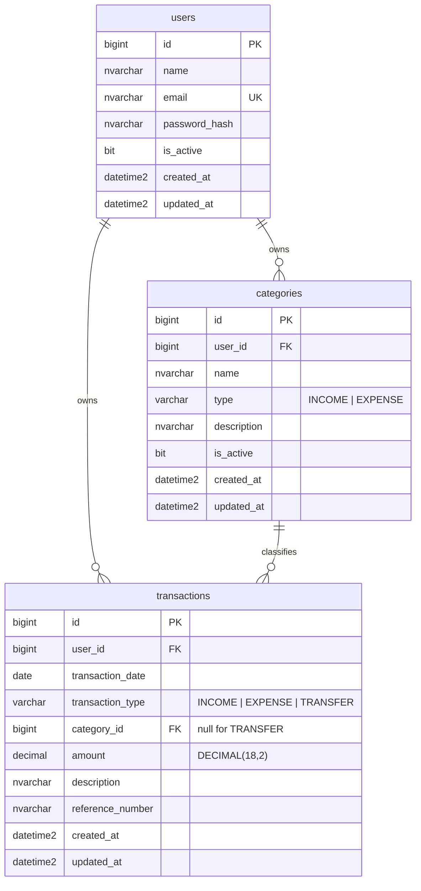

# Database

SQL Server 2022. All identifiers are `snake_case`.

## ERD



## Tables

### users

| Column | Type | Notes |
| --- | --- | --- |
| `id` | `BIGINT IDENTITY(1,1)` | PK |
| `name` | `NVARCHAR(150) NOT NULL` | |
| `email` | `NVARCHAR(255) NOT NULL` | unique |
| `password_hash` | `NVARCHAR(255) NOT NULL` | bcrypt, never returned by the API |
| `is_active` | `BIT NOT NULL DEFAULT 1` | inactive users cannot log in |
| `created_at` | `DATETIME2(3) NOT NULL DEFAULT SYSUTCDATETIME()` | UTC |
| `updated_at` | `DATETIME2(3) NOT NULL DEFAULT SYSUTCDATETIME()` | UTC |

### categories

| Column | Type | Notes |
| --- | --- | --- |
| `id` | `BIGINT IDENTITY(1,1)` | PK |
| `user_id` | `BIGINT NOT NULL` | FK → `users(id)` |
| `name` | `NVARCHAR(100) NOT NULL` | unique per user and type |
| `type` | `VARCHAR(10) NOT NULL` | `INCOME` or `EXPENSE`, checked |
| `description` | `NVARCHAR(255) NULL` | |
| `is_active` | `BIT NOT NULL DEFAULT 1` | |
| `created_at` | `DATETIME2(3) NOT NULL` | |
| `updated_at` | `DATETIME2(3) NOT NULL` | |

### transactions

| Column | Type | Notes |
| --- | --- | --- |
| `id` | `BIGINT IDENTITY(1,1)` | PK |
| `user_id` | `BIGINT NOT NULL` | FK → `users(id)` |
| `transaction_date` | `DATE NOT NULL` | the accounting date, no time component |
| `transaction_type` | `VARCHAR(10) NOT NULL` | `INCOME`, `EXPENSE` or `TRANSFER`, checked |
| `category_id` | `BIGINT NULL` | FK → `categories(id)`; required for INCOME and EXPENSE, null for TRANSFER |
| `amount` | `DECIMAL(18,2) NOT NULL` | always positive; the type carries the direction |
| `description` | `NVARCHAR(500) NULL` | |
| `reference_number` | `NVARCHAR(100) NULL` | |
| `created_at` | `DATETIME2(3) NOT NULL` | |
| `updated_at` | `DATETIME2(3) NOT NULL` | |

## Constraints

| Constraint | Definition |
| --- | --- |
| `uq_users_email` | `UNIQUE (email)` |
| `uq_categories_user_type_name` | `UNIQUE (user_id, type, name)` |
| `ck_categories_type` | `type IN ('INCOME','EXPENSE')` |
| `ck_transactions_type` | `transaction_type IN ('INCOME','EXPENSE','TRANSFER')` |
| `ck_transactions_amount_positive` | `amount > 0` |
| `ck_transactions_category_required` | category is required unless the type is `TRANSFER` |
| `fk_categories_user` | → `users(id)` `ON DELETE CASCADE` |
| `fk_transactions_user` | → `users(id)` `ON DELETE CASCADE` |
| `fk_transactions_category` | → `categories(id)` `ON DELETE NO ACTION` |

`ON DELETE NO ACTION` on the category FK is deliberate: deleting a category that still has
transactions must fail loudly rather than silently orphan or erase financial history. The
service returns 409 in that case and suggests deactivating instead.

## Indexes

| Index | Columns | Serves |
| --- | --- | --- |
| `uq_users_email` | `email` | login lookup |
| `ix_transactions_user_date` | `user_id, transaction_date DESC` | list and report, the dominant query |
| `ix_transactions_user_type_date` | `user_id, transaction_type, transaction_date` | dashboard totals per type |
| `ix_transactions_user_category` | `user_id, category_id` | expense-by-category report |
| `ix_transactions_reference` | `user_id, reference_number` | reference lookup and search |
| `ix_categories_user_type` | `user_id, type, is_active` | category pickers |

The two composite transaction indexes are leading-column compatible with `user_id`, so every
ownership-scoped query can seek rather than scan.

## Migrations

`golang-migrate` with plain SQL pairs in `apps/backend/migrations`:

```
000001_create_users.up.sql      / .down.sql
000002_create_categories.up.sql / .down.sql
000003_create_transactions.up.sql / .down.sql
```

Run them with `make migrate` (up) or `make migrate-down` (one step back). The runner is a
Go binary, so no extra CLI has to be installed.

`database/migrations` is kept as the canonical copy for DBA review and is generated from the
backend folder by `make sync-db-docs`; the application only ever reads
`apps/backend/migrations`.

## Seeds

`make seed` inserts a development user and a starter category set:

- `admin@example.com` / `Admin123!`
- categories: Salary, Bonus, Food, Transport, Cicilan Rumah, Household, Shopping, Entertainment, Other
- a month of sample transactions so the dashboard and reports have something to show

The seed is idempotent and refuses to run when `APP_ENV=production`.

## Timezone

All timestamps are stored in UTC. `transaction_date` is a `DATE`, so it carries no timezone
at all. Presentation in Asia/Jakarta is the frontend's job; the API returns dates as
`YYYY-MM-DD` and timestamps as RFC3339 UTC.
